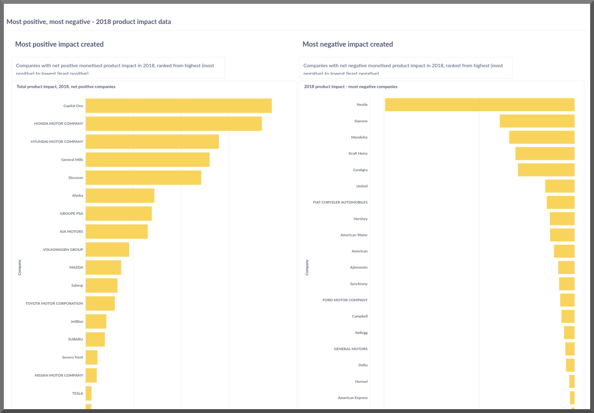
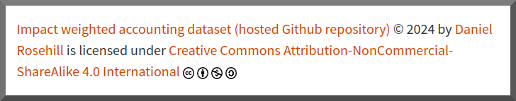

# Impact Weighted Accounts: Datasets And Visualisations Library 

- ***What if companies' holistic impacts were reflected in standard accounting practices!?***
- ***Would an airline still be profitable if its damage to the environment were captured in its financial accounts!?***
- ***And many more questions like these...*****

*Above: an example visualisation derived from the Impact Weighted Accounts Initiative (IWAI) product impact dataset (2021). The left column shows companies with the most positive monetised impact created, organised from highest to lowest. The right column shows the companies with the most negative total monetised impact created, organised from "highest" (most negative) to lowest (least negative)*

------

**Welcome!**

This Github repository was created to host data releases and data visualisations for prospective impact-weighted accounting methodologies as being developed by various organisations around the world.

## Data Formatting, Databases

Where possible, the data will be optimised for integration with common data analysis and visualisation tools like Tableau, Metabase, and Superset:

| **Format** | For Use With                    |
| ---------- | ------------------------------- |
| CSV        | Data analysis and visualisation |
| JSON       | Data analysis and visualisation |

Long-term ambition: making some of the main datasets available through a public API.

The CSVs presented should (operative world: should!) pass validation for common database engines like SQL, PostgresSQL (header rows have been edited for this purpose whenever possible).

------

## Attribution And Notes 

⚠️  **This project is a personal project and is not affiliated with any of the entities that may be mentioned here.** 

Every effort has been made to offer proper attribution to the original authors of the datasets and work - and to distinguish between original data and analyses conducted on the basis of that work.

------

## 🗺️ Important Folders (A Map To This Repository!)

| Folder                   | The Goodies Inside                                           |
| ------------------------ | ------------------------------------------------------------ |
| Documentation            | This folder will contain documentation (in Markdown) describing the impact valuing methodologies as applied by the creating entities whose work is featured here. |
| Enrichment               | This folder will contain notes and ideas about data enrichment (like possible sources and APIs that can be layered with this data). Given that injecting dynamic data isn't possible on a static frontend the data itself will not be presented. |
| Insights                 | Insights derived from the data                               |
| IWAI                     | Time-marked outputs from IWAI                                |
| IWAI_Product_Impact_2021 | Analyses from the 2021 product impact dataset released by IWAI |
| Queries                  | Preformatted SQL queries for running on the datasets to yield interesting results ... or directions for further analysis |
| Visualisations           | This directory will host visualisations from the datasets referenced both in Markdown (images and explanations) and in image formats. |

## 📁 Quick Downloads & Links

Use the **validation dataset** to test-drive the data.

------

## Authorship, Attribution:

Data visualisations, aggregations, repository: Daniel Rosehill

Dataset: Original authors

Licensing:

### Contact

To get in touch, share releases, or amend datasets:

contact at danielrosehill dot com.
